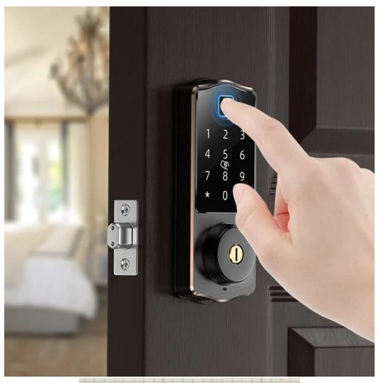

## Task 21: Digital Door Lock System

#### Overview
Design a digital door lock system with the following features:
1. **Keypad** for password input.
2. **LCD** for status display.
3. **Servo motor** to physically unlock/lock the door.
4. **Buzzer** for audio feedback.
5. **EEPROM** for saving the password and state.
6. **Serial port** to display the first-time password for factory use.

#### Features and Flow

1. **Initial Setup**
   - On the first run, generate a random 6-digit password using `rand()`.
   - Send the password to the **serial port** for factory workers to print on the product package.
   - Save this password to **EEPROM** so that it persists after power off.
   - Check a reserved flash memory location; if it contains `0xFF`, proceed with the first-time setup, including clearing EEPROM locations. After setup, change the memory location to a non-`0xFF` value like `0x55` or `0xAA`.

2. **Password Input and Door Operation**
   - **LCD**:
     - First line: Display "Enter password".
     - Second line: Display the password entered via the keypad (e.g., "324618").
   - If the password is correct:
     - Rotate the **servo motor** from 0 to 180 degrees (unlock the door).
     - Display on the first line: "Door Unlocked [time remaining]" (5 seconds countdown).
     - After 5 seconds, rotate the servo back to 0 degrees (lock the door) and reset the LCD to "Enter password".
     - **Buzzer**: Short beep (300 ms) for correct password.
   - If the password is incorrect:
     - Display the number of wrong attempts on the LCD (e.g., "W1", "W2"...).
     - **Buzzer**: Long beep (1 second).
     - After 5 incorrect attempts:
       - Display "Door disabled".
       - Ignore all further keypad inputs.
       - **Buzzer**: Continuous beep until reset at the factory.
       - Save wrong attempts to **EEPROM** to ensure persistence across power cycles.

3. **Password Change Mode**
   - Long press the **ON/C key** for 10 seconds to initiate password change mode.
   - Prompt the user to enter the current password.
     - If correct, allow password change.
     - If incorrect:
       - **LCD**: Show number of incorrect old password attempts (e.g., "C1", "C2"...).
       - **Buzzer**: Short beep 3 times.
       - After 3 wrong attempts, ignore further key presses and sound a continuous buzzer.
   - In password change mode:
     - **LCD**:
       - First line: Display "Enter new pass".
       - Second line: Show the entered digits.
     - Save the new 6-digit password to **EEPROM** (do not send it to the serial port for security).

#### State Machine Implementation
- Use a **state machine** (with `switch-case`) to manage the device's states:
  - **NEW_DEVICE**: Initial setup (random password generation, first-time EEPROM write).
  - **ENTER_PASS**: Default state for password input.
  - **DISABLED**: After 5 incorrect attempts.
  - **NEW_PASS**: Password change mode.
- Reserve memory locations in **EEPROM** for:
  - Password storage.
  - Wrong attempt counters.
  - Flash memory status (to check if the device is newly programmed).

#### Additional Notes:
- Ensure that the number of wrong attempts persists in **EEPROM** across power cycles.
- The system should be designed such that only a factory reset can re-enable the keypad after 5 incorrect attempts or 3 incorrect old password entries.

